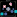
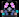
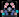
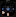
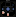
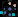
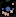

# Key Switches

This is a [KiCad](https://www.kicad.org/) footprint library of mechanical keyboard switches, released under the [CERN-OHL-P v2](/LICENSE).

## ★ このフォーク限定: プレートのカット線（上流には無い。2026-08-29）

**33 個すべての `.kicad_mod` に、キーボードプレート加工用のカット線
（`fp_rect`、原点中心、線幅 0.05mm）を追加してある。** 各ファイルには
そのスイッチに該当するレイヤだけが入っている（`descr` フィールドにも同じ対応を記載）:

| レイヤ | 開口 | 対象スイッチ | 入っているファイル |
|---|---|---|---|
| `User.1` | **15.60mm 角** | 化粧カバー（スイッチを掴まない。全スイッチ共通） | 全 33 ファイル |
| `User.2` | **14.00mm 角** | **MX / MX Low Profile / Gateron Low Profile** | `SW_MX_*` `SW_Gateron_*`（21） |
| `User.3` | **13.95mm 角** | **Kailh Choc V2（PG1353）** | `*Choc_V2*` `*Choc_V1V2*`（9） |
| `User.4` | **13.80mm 角** | **Kailh Choc V1（PG1350）** | `*Choc_V1_*` `*Choc_V1V2*`（15） |

- **レイヤ＝プレート案の排他選択。** 書き出すレイヤを 1 つ選べばプレートの種類が決まる。
  ハイブリッド系のフットプリントには該当レイヤが複数入っているが、共存してよい
- **MX 系はすべて 14.00mm 角**（通常の Gateron は MX クローンで `SW_MX_*` を使う。
  低背 2 種も開口は同じだが、推奨プレート厚が違う: Gateron LP は 1.2mm）
- **★ 13.95 と 14.00 の差 0.05mm は JLCPCB のルーター公差（±0.2mm）より小さく、
  実物で区別できない可能性が高い。** 実物比較で差が出なければ V2 も 14.00 に寄せて
  `User.3` を廃止してよい（緩くなる側なので安全）。値の変更は各ファイル数字 1 か所
- **出典**: Choc V1=13.80 / V2=13.95 は
  [cyril279/keyboards revlp/41_1353](https://github.com/cyril279/keyboards/blob/main/revlp/41_1353/README.md)、
  Gateron LP の 14.00 は公式データシートの取付図
  （[KS-27](https://www.gateron.co/pages/gateron-low-profile-mechanical-switch-datasheet) /
  [KS-33](https://www.gateron.co/pages/gateron-ks-33-low-profile-2-0-mechanical-switch-datasheet)）、
  Cherry MX LP が 14×14 に入ることは
  [Deskthority wiki](https://deskthority.net/wiki/Cherry_MX_Low_Profile)
- **検証**: KiCad 10.0.5 の `kicad-cli fp export svg` で 33 ファイル全部のパースを確認済み。
  DXF 書き出しは 20° 回転を含む配置で `User.1/2/3` から 15.600 / 14.000 / 13.950mm が
  出ることを確認済み（線幅は書き出しに出ないので値は自由に変えてよい）
- `preview/` の画像もカット線入りで再生成してある
  （`kicad-cli fp export svg` + 黒背景化。ベースは上流コミット `b4afad5`）

## ★ このフォーク限定: キーキャップサイズバリアント `variants-*.pretty`（2026-08-30）

**`single.pretty/` + `double.pretty/` の 33 ベースフットプリントから、
キーキャップサイズ別のバリアント（1268 ファイル）をスイッチ種別の
4 ライブラリに自動生成してある**（`variants-mx` 550 / `variants-choc` 406 /
`variants-mx-choc` 220 / `variants-gateron` 92。それぞれ別ライブラリとして登録）。
再生成は `python3 scripts/generate_variants.py`。

- **ベース（直下 33 ファイル）= キーキャップなし**。コートヤードはスイッチ単体の
  占有範囲（16.5mm 角）のまま
- **バリアントのコートヤード = キーキャップ 1u=19.05mm ピッチの占有範囲**。
  DRC の「コートヤード重複」で他部品との干渉を検出できる。
  外縁は公称より各辺 0.025mm 控え（例: 1u → 19.00mm 角）にしてあり、
  19.05mm ピッチで隣接するキー同士は誤検出しない
- **命名**: `<ベース名>_<サイズ>[_<スタビ>][_Diode]` 。サイズは
  `1.00u` `1.25u` `1.50u` `1.75u` `2.00u` `2.25u` `2.75u` `3.00u` `4.50u`
  `6.00u` `6.25u` `6.50u` `7.00u` `ISOEnter` `ISOEnterFlip`（ISO Enter の上下反転。キーキャップ外形のみ反転、スイッチとスタビの向きはそのまま）。
  `_Diode` は裏面 SMD ダイオードパッド付き（次節）
- **スタビライザー**（2u 以上と ISO Enter）:
  - **サフィックス無し版 = スタビ用の PCB 要素なし**。MX のプレートマウントスタビは
    そのまま使える
  - **Cherry MX PCB マウント用 → `_MXPCBStab` 版**（MX 系ベース 18 種のみ）。
    NPTH 小穴 Ø3.048（y=−6.985）+ 大穴 Ø3.9878（y=+8.255。小穴と 15.24mm 間隔）、
    ステム位置は 2u系=±11.938 / 3u=±19.05 / 4.5u=±33.3375 / 6u=±47.625 /
    6.25u=±50 / 7u=±57.15mm。
    ISO Enter は縦 2u スタビ（90° 回転、大穴＝ワイヤー側が x=−8.255 の左側。
    逆向きに実装する場合は基板側でフットプリントを 180° 回転）。
    **スタビ用プレートカット線は `User.5`**（6.75×14mm 角丸、中心 y=+1.0、
    kb-plategen "Normal" 準拠。プレートマウント・PCB マウント両対応の
    Cherry スタイルなので、プレートマウントスタビで組む場合も
    `_MXPCBStab` 版を使えばカット線が得られる。NPTH 穴は未使用でも無害）
  - **Kailh Choc 1350（V1）スタビ用 → `_ChocV1Stab` 版**（Choc V1 対応ベース 15 種 ×
    2.00u / 6.25u のみ = Kailh が製造しているサイズ）。丸穴ではなく
    **PCB の角丸スロット切り欠き 4 個（`Edge.Cuts`）+ プレート必須**という方式。
    本体スロット 5.3×5.5mm + ワイヤースロット 4.0×3.5mm（角 R0.5）、
    ステム位置 2u=±12.0 / 6.25u=±38.0mm。スタビ用プレートカット線は `User.5`。
    **Choc V1 スイッチ専用**。ワイヤーが Choc V2 のハウジングと干渉するため
    V2 には使えない（V2 専用ベースには生成しない）
  - **Kailh Choc V2 スタビ（CPG1353G24D01）用 → `_ChocV2Stab` 版**（2.00u のみ =
    Kailh の製造を確認できたサイズ）。対応スイッチは **Choc V2 / Gateron KS-33**
    で、**Choc V1 とは非互換**（Keebio 商品ページ準拠）。
    **PCB の矩形スロット切り欠き 2 個（`Edge.Cuts`、6.5×9.5mm、中心 x=±12.0）+
    プレート必須**。スタビ用プレートカット線は `User.5`（本体 5.95×7.95 +
    突出 4.55×6.25 + ワイヤー溝 全幅×1.4mm、角 R0.5、kb-plategen 準拠。
    3 種の角丸矩形は互いに重なるのでプレート CAD 側で union する）。
    ホットスワップ系ベースはソケットパッドがスロットと物理干渉するため
    生成対象外（THT 系 6 種のみ。生成スクリプトの干渉チェックで自動判定）
  - **6.50u は PCB マウントスタビの標準規格が無い**（kiswitch / marbastlib にも無い）
    ため `_MXPCBStab` 版は生成していない

### スイッチ × スタビライザー対応表

| 実装するスイッチ | MX プレートマウント<br>→ サフィックス無し | MX PCB マウント<br>→ `_MXPCBStab` | Kailh Choc 1350 (V1)<br>→ `_ChocV1Stab` | Kailh Choc V2<br>→ `_ChocV2Stab` |
|---|---|---|---|---|
| Cherry MX | ○ | ○ | ✕ | ✕ |
| Cherry MX Low Profile | △ 高さ互換未検証 | △ 高さ互換未検証 | ✕ | ✕ |
| Kailh Choc V1 (PG1350) | ✕ | ✕ | ○ | ✕ |
| Kailh Choc V2 (PG1353) | ✕ | ✕ | ✕ ワイヤー干渉 | ○ |
| Gateron Low Profile | ✕ | ✕ | ✕ | ○ KS-33（KS-27 は情報なし） |
| Hybrid（MX × Choc） | 実際に載せるスイッチの行に従う | 同左 | 同左 | 同左 |

- 「プレートマウント」と言っても MX 用と Choc 用のスタビは別部品で互換性はない
  （プレート開口形状・高さ・PCB への要求がすべて異なる）
- Hybrid ベースはスイッチ穴こそ MX / Choc 両対応だが、**スタビ付きキーは
  バリアント選択時点でどちらで組むか決める必要がある**（2u では MX NPTH 穴と
  Choc スロットが幾何的に共存できない）。Choc 側の可能性を残したい場合は
  `_ChocV1Stab` / `_ChocV2Stab` を選ぶ（MX で組むときはプレートマウント MX スタビが
  併用可能。`_MXPCBStab` を選ぶと Choc ビルドでのスタビ手段が無くなる）
- MX スタビ用のプレート開口線は `_MXPCBStab` 版の `User.5` にある（Cherry
  スタイル = プレートマウント・PCB マウント両対応）。プレートマウントスタビで
  組む場合もカット線目的で `_MXPCBStab` 版を使ってよい（NPTH 穴は無害）
- **寸法出典**: [kiswitch](https://github.com/kiswitch/kiswitch)
  （`KiSwitch/switch.py` StabilizerCherryMX のステム間隔 / `keycap.py`）と
  [marbastlib](https://github.com/ebastler/marbastlib)（CERN-OHL-P v2。
  `STAB_MX_*` の穴 y 座標・4.5u、`STAB_choc_*` の Choc V1 スロット形状）と
  [Keebio-Parts.pretty](https://github.com/keebio/Keebio-Parts.pretty)（MIT。
  `Kailh-Choc-V2-2u-Stabilizer-CPG1353G24D01-Cutout` の Choc V2 スロット形状）と
  [kb-plategen](https://github.com/keebio/kb-plategen)（MIT。
  `StabilizerCutout.ts` の MX / Choc V2 スタビ用プレートカット寸法）。
  ISO Enter の外形（上段 1.5u + 下段 1.25u 右端揃え、スイッチは下段列の中心）は
  kiswitch 準拠
- **注意**: キーキャップ範囲のコートヤードは、キャップ下に置くダイオード等も
  DRC エラーにする。物理的に問題ない配置は KiCad 側で除外指定するか、ベース版を使う
- **検証**: KiCad 10.0.5 の `kicad-cli fp export svg` で 1268 ファイル全部のパースを
  確認済み。コートヤード寸法・スタビ穴座標はスクリプトで機械チェック済み。
  プレビュー画像はベース 33 + `_Diode` ベース 27 のみ
  （バリアントは枚数が膨大なため生成しない）

## ★ このフォーク限定: 裏面 SMD ダイオード付き `_Diode` バリアント（2026-08-31）

**手半田できるサイズの表面実装ダイオードを裏面（B.Cu）に組み込んだ `_Diode` 版を
自動生成してある。** ベース版（コートヤードなし）は `single.pretty/` 内の
`<ベース名>_Diode`（27 ファイル、生成物）、キーキャップサイズ別は各 `variants-*` の
`<ベース名>_<サイズ>[_<スタビ>]_Diode`。

- **パッド**: SMD roundrect **2.0×1.4mm** ×2、ダイオード軸方向 ±1.6mm
  （内縁 0.6 / 外縁 2.6mm）。**SOD-123（1N4148W 等）/ SOD-323（1N4148WS 等）/
  MiniMELF（LL-34、LL4148 等）兼用**の手半田ロングパッド
- **パッド番号**: `1` `2` = スイッチ / **`3` = ダイオードのアノード /
  `4` = カソード**。フットプリント内で 2-3 間は接続していないので、
  通常の行列マトリクスなら基板配線で 2→3（または 1→4）をつなぐ
- **回路図シンボル**: `symbols/key-switch-diode.kicad_sym` の **`SW_Key_Diode`**
  （スイッチ＋直列ダイオード一体、ピン 1/2/3=A/4=K）を使う。
  全 `_Diode` フットプリント共通
- **配置**（全スイッチ種別で統一）: **左端に縦置き、中心 (−7.2, −4.0)、
  カソード = 上**
  - 中央北側 y≈−4.7 の**バックライト LED 窓**（Choc V1/V2・MX 等。
    SK6812 MINI-E のランドで x≈±3.2mm）から 3mm 以上離れており、
    アンダーグロー/バックライト LED と共存できる
  - スイッチ単体のコートヤード（16.5mm 角）内に完全に収まる =
    Choc ホットスワップ等でソケットパッドが左右にはみ出す帯
    （隣接キーと重なる領域）にはかからない。ホットスワップソケット本体
    （下半分）からも離してあり、こてが入る
  - 最小クリアランスは Choc サイドボス NPTH (−5.5, 0) との 0.87mm
- **生成対象外（自動スキップ）**: 裏面に物理干渉がある 6 ベース =
  両面実装の `double.pretty` 全 5 種と `SW_MX_Kailh_Choc_V1V2_HotSwap_Hybrid`
  （MX ソケットが裏面上半分を占有）。`_alt1` 版は両ソケットとも下半分なので生成される
- **Compatibility Table（下記・上流のまま）の各フットプリントについて、
  スイッチ互換性は `_Diode` 版でも同一**（ダイオード要素の追加のみ）

## ★ このフォーク限定: ライブラリ構成（実装方式で分割。2026-08-30）

上流はリポジトリ直下が 1 ライブラリだったが、このフォークでは**ベースを実装方式、
バリアントをスイッチ種別で `.pretty` に分割**してある。KiCad には使うものを
別ライブラリとして登録する（最大 6 つ）:

| ライブラリ | 内容 | ファイル数 |
|---|---|---|
| `single.pretty/` | **片面実装**ベース（`_alt*` の片面版・`_nSilk`・`_swap` を含む） | 55（手書き 28 + 生成 `_Diode` 27） |
| `double.pretty/` | **両面実装**ベース＝リバーシブル基板用（`_double`、その `_alt1/_alt2` を含む） | 5 |
| `variants-mx.pretty/` | バリアント: MX 純系（ハイブリッド除く。生成物） | 550 |
| `variants-choc.pretty/` | バリアント: Choc 純系（V1 / V2 / Choc V1V2 ハイブリッド。生成物） | 406 |
| `variants-mx-choc.pretty/` | バリアント: MX × Choc ハイブリッド（生成物） | 220 |
| `variants-gateron.pretty/` | バリアント: Gateron Low Profile（生成物） | 92 |

このほか `symbols/key-switch-diode.kicad_sym`（`_Diode` フットプリント用の
スイッチ＋ダイオード一体シンボル `SW_Key_Diode`）をシンボルライブラリとして登録できる。

サフィックスの意味（ベース名の系統）:

- **無印** = 片面実装の標準版
- **`_double`** = 両面実装（リバーシブル基板の表裏どちらにも実装できる）
- **`_alt1` / `_alt2`** = 同機能の代替パッド/穴配置（例: `Kailh_Choc_V1_THT_alt1` は
  クリッキースイッチのバネ逃げ NPTH 追加版。詳細は各 descr と Compatibility Table 脚注）
- **`_nSilk`** = 表シルクなし、**`_swap`** = ピン番号入替え
- HotSwap の **`_PTH`** = ソケット穴メッキあり / **`_THT`** = メッキなし
- **`_Diode`** = 裏面 SMD ダイオードパッド付き（生成物。前節参照）

このフォークを submodule として使う場合は上流ではなくこちらの URL を指定する
（次節「Usage」の URL は上流のまま。また上流と違い**リポジトリ直下は
ライブラリではない**ので、上記 6 フォルダのうち使うものを個別に登録すること）:

```
git submodule add https://github.com/tryandhappy/kicad-key-switch-footprints.git
```

以下は上流（siderakb/key-switches.pretty）の README のまま。

## Usage

It is recommended to use this library with [KiCAD KLE Placer](https://github.com/zykrah/kicad-kle-placer) or [kicad-kbplacer](https://github.com/adamws/kicad-kbplacer) for automatic switch placement.

If you're using Git, you can include this library as a [submodule](https://git-scm.com/docs/git-submodule) via `git submodule add https://github.com/siderakb/key-switches.pretty.git`

Keyboards created using this library: [ErgoSNM](https://github.com/siderakb/ergo-snm-keyboard), [Calcite](https://github.com/siderakb/calcite), [MS60](https://github.com/siderakb/ms60).

## Compatibility Table

|          Preview [^preview]          | Footprint [^sw-prefix]                   |         Cherry MX         | Cherry MX Low Profile |         TTC KS32         |  Kailh Choc V1 [^k-choc1]   |  Kailh Choc V2 [^k-choc2]  | Gateron Low Profile [^g-lp] |     THT [^tht]     |      Hot-Swap      | *nSilk* variants [^ns-suffix] | *swap* variants [^swap-suffix] |
| :----------------------------------: | ---------------------------------------- | :-----------------------: | :-------------------: | :----------------------: | :-------------------------: | :------------------------: | :-------------------------: | :----------------: | :----------------: | :---------------------------: | :----------------------------: |
|  | MX_THT                                   |    :white_check_mark:     |                       |                          |                             |                            |                             | :white_check_mark: |                    |      :white_check_mark:       |                                |
|  | MX_HotSwap_THT                           |    :white_check_mark:     |                       |                          |                             |                            |                             | :white_check_mark: | :white_check_mark: |      :white_check_mark:       |                                |
|  | MX_HotSwap_THT_double                    |    :white_check_mark:     |                       |                          |                             |                            |                             | :white_check_mark: | :white_check_mark: |                               |                                |
|  | MX_HotSwap_THT_double_alt1               |    :white_check_mark:     |                       |                          |                             |                            |                             | :white_check_mark: | :white_check_mark: |                               |                                |
|  | MX_HotSwap_THT_double_alt2               |    :white_check_mark:     |                       |                          |                             |                            |                             | :white_check_mark: | :white_check_mark: |                               |                                |
|  | MX_HotSwap_PTH                           |    :white_check_mark:     |                       |                          |                             |                            |                             |   :bulb: [^pth]    | :white_check_mark: |      :white_check_mark:       |       :white_check_mark:       |
|  | MX_HotSwap_PTH_double                    |    :white_check_mark:     |                       |                          |                             |                            |                             |   :bulb: [^pth]    | :white_check_mark: |                               |                                |
|  | MX_LowProfile_THT                        |                           |  :white_check_mark:   | :bulb: [^t-ks_vs_c-mxlp] |                             |                            |                             | :white_check_mark: |                    |      :white_check_mark:       |                                |
|  | Gateron_LowProfile_THT                   |                           |                       |                          |                             |                            |     :white_check_mark:      | :white_check_mark: |                    |                               |                                |
|  | Gateron_LowProfile_HotSwap_THT           |                           |                       |                          |                             |                            |     :white_check_mark:      | :white_check_mark: | :white_check_mark: |                               |                                |
|  | Gateron_LowProfile_HotSwap_PTH           |                           |                       |                          |                             |                            |     :white_check_mark:      |   :bulb: [^pth]    | :white_check_mark: |                               |                                |
|  | Kailh_Choc_V1_THT                        |                           |                       |                          |     :white_check_mark:      |                            |                             | :white_check_mark: |                    |      :white_check_mark:       |       :white_check_mark:       |
|  | Kailh_Choc_V1_THT_alt1 [^k-cooc1-alt]    |                           |                       |                          |     :white_check_mark:      |                            |                             | :white_check_mark: |                    |                               |                                |
|  | Kailh_Choc_V1_HotSwap                    |                           |                       |                          |     :white_check_mark:      |                            |                             |                    | :white_check_mark: |      :white_check_mark:       |                                |
|  | Kailh_Choc_V1_HotSwap_THT                |                           |                       |                          |     :white_check_mark:      |                            |                             | :white_check_mark: | :white_check_mark: |                               |                                |
|  | Kailh_Choc_V1_HotSwap_PTH                |                           |                       |                          |     :white_check_mark:      |                            |                             |   :bulb: [^pth]    | :white_check_mark: |                               |                                |
|  | Kailh_Choc_V2_THT                        |                           |                       |                          |                             |     :white_check_mark:     |                             | :white_check_mark: |                    |      :white_check_mark:       |                                |
|  | Kailh_Choc_V1V2_THT_Hybrid               |                           |                       |                          | :bulb:[^k-choc1_vs_k-choc2] |     :white_check_mark:     |                             | :white_check_mark: |                    |                               |                                |
|  | Kailh_Choc_V1V2_HotSwap_Hybrid           |                           |                       |                          | :bulb:[^k-choc1_vs_k-choc2] |     :white_check_mark:     |                             |                    | :white_check_mark: |                               |                                |
|  | MX_Kailh_Choc_V1V2_THT_Hybrid            | :bulb: [^c-mx_vs_k-choc2] |                       |                          | :bulb:[^k-choc1_vs_k-choc2] |     :white_check_mark:     |                             | :white_check_mark: |                    |                               |                                |
|  | MX_Kailh_Choc_V1V2_HotSwap_Hybrid        | :bulb: [^c-mx_vs_k-choc2] |                       |                          | :bulb:[^k-choc1_vs_k-choc2] |     :white_check_mark:     |                             |                    | :white_check_mark: |                               |                                |
|  | MX_LowProfile_Kailh_Choc_V1V2_THT_Hybrid |                           |  :white_check_mark:   | :bulb: [^t-ks_vs_c-mxlp] | :bulb:[^k-choc1_vs_k-choc2] | :bulb:[^k-choc2_vs_c-mxlp] |                             | :white_check_mark: |                    |                               |                                |

> :white_check_mark:: Compatible; :bulb:: Conditionally compatible; Blank: Not compatible.

[^preview]: Preview images are exported using the `kicad-cli fp export svg` command and processed.
[^tht]: THT means through-hole soldering.
[^pth]: PTH means the holes of the Hot-Swap socket are plated, and the switches can be soldered directly without using a socket. However, the soldering difficulty is higher compared to the standard THT edition.
[^k-choc1]: Kailh Choc V1 also known as PG1350.
[^k-choc2]: Kailh Choc V2 also known as PG1353.
[^g-lp]: Gateron Low Profile 1.0 (aka KS-27) and 2.0 (aka KS-33) footprint are compatible.
[^t-ks_vs_c-mxlp]: TTC KS32 and Cherry MX Low Profile are very similar, basically compatible.
[^k-choc1_vs_k-choc2]: The center fix pin of Choc V1 is smaller than Choc V2, however Choc V1 has two additional fix pins ensuring its stability.
[^k-choc2_vs_c-mxlp]: The center fix pin of Choc V2 is smaller than Cherry MX Low Profile, Choc V2 may not be securely fastened.
[^c-mx_vs_k-choc2]: The center fix pin of Cherry MX is smaller than Choc V2, however some Cherry MX has two additional fix pins ensuring its stability.
[^sw-prefix]: Omit the "SW" prefix from the footprint name.
[^ns-suffix]: The footprint with "nSilk" suffix means no top layer silkscreen.
[^swap-suffix]: The footprint with "swap" suffix means the pin number swap.
[^k-cooc1-alt]: *Kailh_Choc_V1_THT_alt1* has one more NPTH than *Kailh_Choc_V1_THT*, and this hole is located at the position of the spring in the Clicky switch (e.g. White, Jade). If you are likely to use Clicky switches it is recommended to use *Kailh_Choc_V1_THT_alt1*.
